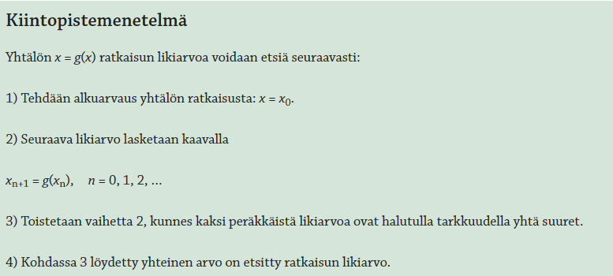

# Työohje

Toteuta ohjelmoimalla yhtälön numeerinen ratkaisumenetelmä. Voit valita haluatko toteuttaa puolitusmenetelmän vai kiintopistemenetelmän.

## Puolitusmenetelmä

## Kiintopistemenetelmä

## Arviointi

Ihan ok:

- Ohjelma osaa ratkaista funktion numeerisesti
- Ohjelmaan kirjoitetaan alkuarvaus / aloitusväli esim. Geogebran kuvan perusteella

Hyvä:

- Edellisen lisäksi piirrä funktion kuvaaja Pythonilla. Käytä tähän matplotlib-kirjastoa.
- Vinkki, Google on sinun kaverisi näissä asioissa. Etsi tietoa myös englanniksi.
- Virallisen matplotlib-kirjaston aloitusopas löytyy [[tästä linkistä][https://matplotlib.org/stable/tutorials/introductory/pyplot.html]]

Erinomainen:

- Aluksi piirretään funktion kuvaaja matplotlib-kirjastolla
- Käyttäjältä kysytään alkuarvaus / aloitusväli kuvan perusteella
- Ohjelma ratkaisee yhtälön